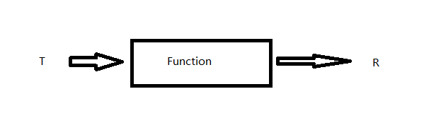

##### 1. 看以下Function函数接口，回答问题
```java
    public interface Function<T, R> {
        R apply (T t);
    }
```
a. 画出该函数接口图示




b. 若要编写计算机程序，会使用该接口表示怎样的Lambda表达式

c. 下列哪些Lambda表达式有效实现了Function<Long, Long> 
```
    x -> x + 1; ---------√
    (x, y) -> x + 1;
    x -> x == 1;
```

##### 2. ThreadLocal Lambda表达式。java中有一个ThreadLocal类，作为容器保存了当前线程里局部变量的值。java8为该类新加了一个工厂方法，接收一个Lambda表达式，并产生一个新的ThreadLocal对象，而不使用继承，语法更简洁

a. 在JavaDoc或IDE找出该方法


b. DataFormatter类是非线程安全的。使用构造函数创建一个线程安全的DateFormatter对象，并输出日期，如"01-Jan-1970"


##### 3. ***类型推断规则*** 下面是将Lambda表达式作为参数传递给函数的一些例子。javac能正确判断出Lambda表达式中的参数类型吗？程序能编译吗？

a. 
```
    Runnable helloWorld = () -> System.out.println("hello world");
```

b. 使用Lambda表达式实现ActionListener接口
```
    JButton button = new JButton();
    button.addActionListener(event ->
        System.out.println(event.getActionCommand()));
```

c. 以如下方式重载check方法后，还能正确推断出 check(x -> x > 5)的类型吗？
```
    interface IntPred{
        boolean test(Integer value);
    }

    boolean check(Predicate<Integer> predicate);

    boolean check(IntPred perdicate);
```


[https://github.com/RichardWarburton/java-8-Lambdas-exercises]